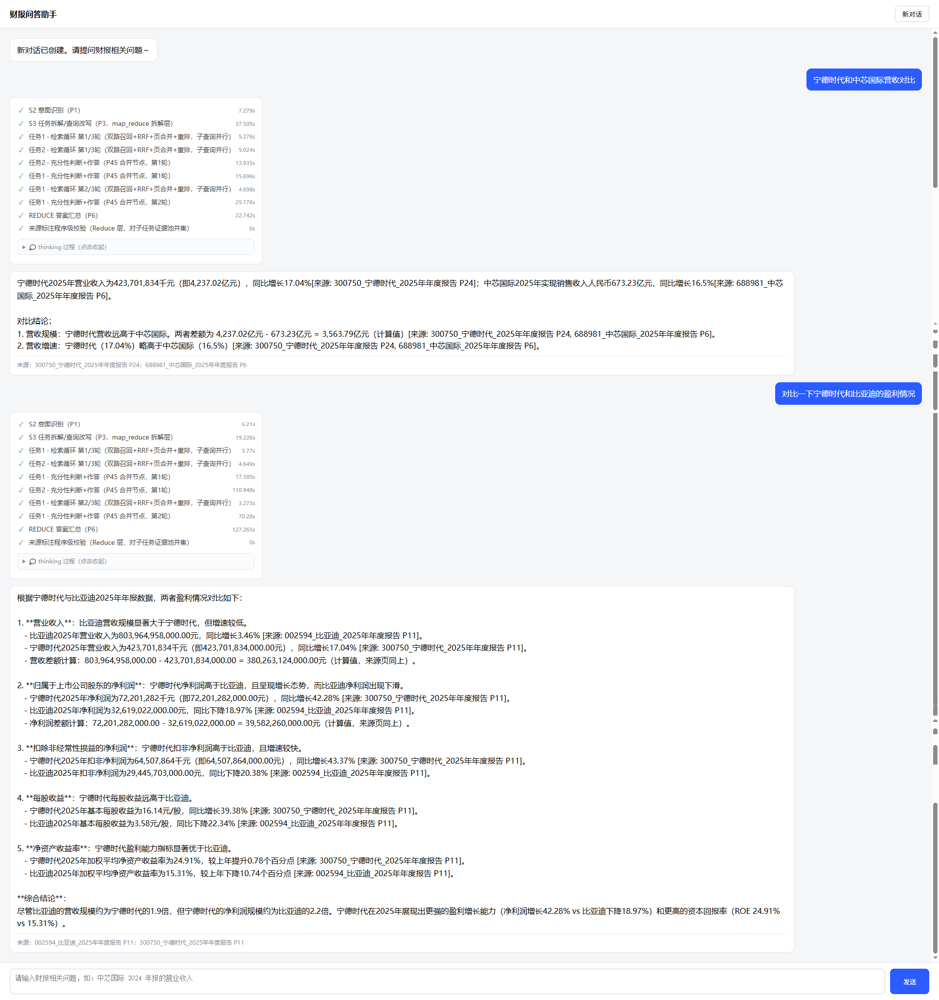

# Case35 · 财报智能问答系统（RAG QA）

面向上市公司财报（年报/半年报/季报）的离线文档问答系统：从 PDF 原始文件出发，经过解析、清洗、切分、双路索引构建，最终通过 Web 页面提供**有据可查、可验证、可追溯**的智能问答服务。

```
PDF ──► MinerU 解析 ──► LLM 校验 ──► 页级扁平化 ──► 分块
                                                     │
                              ┌──────────────────────┤
                              ▼                      ▼
                        Milvus 向量库           BM25 本地索引
                              └──────────┬───────────┘
                                         ▼
              提问 ──► 意图+拆解 ──► 子任务并行检索循环 ──► 汇总 ──► 带来源的回答
```

## 系统亮点

### 1. 混合检索 + RRF 融合，召回质量高于单路方案

- **向量路**：text-embedding-v4 + Milvus（HNSW），捕获语义相似；
- **关键词路**：BM25 + jieba，精确命中指标名称、专有名词、数字表述；
- **RRF 倒数排名融合**：两路互补——财报场景里"研发设备原值"这类精确口径词靠 BM25 兜底，口语化问法靠向量路兜底；
- **页级归并重排**：chunk 命中去重回查整页原文，再用 qwen3-rerank 精排，LLM 拿到的是完整页上下文而非割裂的片段，杜绝"碎片化证据导致的断章取义"。

### 2. Map-Reduce 多子任务架构，复杂问题不降智

- 多意图 / 对比型 / 反问型问题被拆解为**多个独立子任务**，每个子任务拥有**独立的检索循环与隔离的证据池**，互不挤占 token 预算；
- 子任务**线程池并行执行**，多公司对比类问题的耗时不随子任务数线性增长；
- 单子任务时自动短路跳过 Reduce 汇总，避免"一次 LLM 调用复述另一个调用的结果"。

### 3. 检索-判断-作答解耦，循环自我纠错

- 每轮检索后由轻量**充分性判断节点**（只判断不写答案）评估证据：口径不符、数值缺失、证据矛盾都会被识别并自动生成补充检索查询；
- 不足则自动补充检索（最多 `max_loops` 轮），**判定充分后才调用作答节点**一次性生成回答——判断环节输出 token 极少，循环成本低；
- 专门的核心规则：**指标口径强校验**（"归母净利润"≠"净利润"、"原值"≠"净值"），名称相近的指标不会冒充答案。

### 4. 程序级来源校验，幻觉可被机器拦截

- 回答中的每条 `[来源: 报告名 P页码]` 标注由**程序与证据池求交集验证**：引用了不存在的报告或页码的段落被**整段自动剔除**，并计入日志；
- 全部标注被剔除时降级为附证据池高分页清单，用户永远有可核对的来源；
- 计算值（增速/差额等四则运算）强制要求列出计算式并标注每个参与数值的来源页，与报告原文数字严格区分。

### 5. 全链路耗时观测，性能可量化可优化

- 每步耗时（LLM 各节点、embedding、Milvus load/search、BM25、RRF、页归并、rerank）分项统计；
- 每轮问答落盘 `data/logs/qa_timing.json`（按耗时降序汇总表）+ `data/logs/qa_turns.json`（完整过程记录含 `step_timings`）；
- 瓶颈定位不需要猜：打开日志即可看到"慢在哪个 LLM 节点、哪条子查询、哪个检索通道"。

### 6. 流式 Web 体验：过程可见、进度可感

- SSE 流式推送：**thinking 过程实时逐字展示**（各 LLM 节点输出带标签区分）、**流程进度动态点亮**（每步 spinner → ✓ + 耗时）、等待缓冲动画；
- 回答完成后 thinking 自动收起，来源清单附在答案下方，一键核对。

实际运行效果（完整问答过程长截图，点击查看原图 [`docs/wechat_longscreenshot_2026-09-24_125536_052.png`](docs/wechat_longscreenshot_2026-09-24_125536_052.png)）：



### 7. 工程化约束严格，可维护性强

- **提示词零硬编码**：P0~P6 全部集中 `config/prompts.yaml`，改提示词不动代码；
- **严格模式配置**：任何配置缺失/为空直接报错终止，不静默兜底、不用默认值掩盖问题；
- **LLM 输出三级防线**：API 级 JSON 约束 + 解析失败修复旁路 + 重试，全部用尽才抛异常；
- **会话记忆滚动压缩**：多轮对话的指代追问（"它呢？""和上一年比呢"）自动消解，长对话摘要压缩不爆上下文。

## 文档导航（docs/）

| 文档 | 内容 | 什么时候看 |
|---|---|---|
| [执行手册.md](docs/执行手册.md) | 数据处理阶段 step0~step5 逐步执行命令 | 首次入库 / 重灌数据 |
| [数据处理阶段设计方案.md](docs/数据处理阶段设计方案.md) | PDF → JSON → 校验 → 摊平 → 切片 → 入库 的设计定稿 | 了解数据管线设计 |
| [检索问答阶段设计方案.md](docs/检索问答阶段设计方案.md) | 在线 QA 服务架构（Map-Reduce、检索循环、来源校验） | 了解问答系统设计 |
| [召回执行命令.md](docs/召回执行命令.md) | 问答服务启动 / 环境变量 / uvicorn 部署命令 | 启动服务时 |
| [召回流程梳理与漏洞清单.md](docs/召回流程梳理与漏洞清单.md) | S3→S6 召回链路逐步走查记录与已修复漏洞 | 排查召回问题 / 二次开发前 |
| [配置说明.md](docs/配置说明.md) | pipeline_config.json 全部配置项详解（严格模式） | 调参 / 改配置 |

## 目录结构

```
case35/RAG/
├── scripts/            # 数据处理管线（step0~step6，与问答严格分离）
│   ├── step0_scan.py       # 文件扫描 + 文件名元数据识别
│   ├── step1_mineru.py     # MinerU PDF 解析
│   ├── step2_render_md.py  # LLM 自动校验 Markdown
│   ├── step3_flatten.py    # 页级扁平化
│   ├── step4_chunk.py      # 分块
│   ├── step5_milvus.py     # 向量入库（text-embedding-v4）
│   └── step6_bm25.py       # BM25 索引构建
├── qa/                 # 在线问答服务
│   ├── pipeline.py         # 主编排（Map-Reduce、证据池、来源校验）
│   ├── stages.py           # LLM 节点（意图/拆解/判断/作答/汇总/压缩）
│   ├── retrieval.py        # 双路检索 + RRF + 页归并 + rerank
│   ├── memory.py           # 会话存储与记忆压缩
│   ├── steplog.py          # 步骤日志 + 耗时统计 + 事件流
│   └── service.py          # FastAPI 入口（REST + SSE 流式）
├── webapp/index.html   # 前端（thinking 面板 / 动态进度 / 等待动画）
├── config/             # pipeline_config.json（参数）+ prompts.yaml（提示词）
├── data/               # 数据产物（不入库）+ logs/（过程与耗时日志）
└── deploy/             # docker-compose.yml（Milvus）
```

## 快速开始

```bash
pip install -r requirements.txt
docker compose -f deploy/docker-compose.yml up -d      # 启动 Milvus

# 数据入库（按序执行，详见 docs/召回执行命令.md）
python scripts/step0_scan.py && python scripts/step1_mineru.py && \
python scripts/step3_flatten.py && python scripts/step4_chunk.py && \
python scripts/step5_milvus.py && python scripts/step6_bm25.py

# 启动问答服务
python -m uvicorn qa.service:app --host 127.0.0.1 --port 8800
# 打开 http://127.0.0.1:8800
```

## 主要配置项（config/pipeline_config.json → qa_service.retrieval）

| 配置 | 含义 | 调优方向 |
|---|---|---|
| `vector_top_n` / `bm25_top_n` | 双路各召回条数 | 召回不足时调大 |
| `rerank_candidates` | 进入精排的页数上限 | 精度/耗时权衡 |
| `top_pages_per_loop` | 每轮进证据池的页数 | 控制证据池膨胀 |
| `max_loops` | 检索循环上限 | 平衡耗时与召回 |
| `evidence_token_budget` | 证据池 token 预算 | 控制 prompt 长度 |
| `max_workers` / `map_workers` | 子查询 / 子任务并行度 | 多任务场景提速 |
| `llm.max_retries` | LLM 重试次数 | 严格模式，不静默兜底 |

## 日志与排障

- `data/logs/qa_turns.json`：每轮问答全过程（意图、查询计划、每轮检索命中、判断结论、来源校验结果、耗时）；
- `data/logs/qa_timing.json`：耗时专项（各步骤按耗时降序 + LLM 调用耗时/重试/修复次数）；
- 控制台同步输出完整的步骤级日志（`steplog`），与落盘内容一致。
