# 召回流程梳理与漏洞清单

> 对 `qa/retrieval.py` + `qa/pipeline.py` 中 S3→S4→S5→S6 召回链路的逐步走查记录。
> 每个环节列：输入 / 处理 / 输出 / 走查结论。走查日期：2026-09-23。
> 走查中发现并已修复的漏洞标 **【已修复】**，仅记录未改动的设计偏差标 **【观察项】**。

---

## 0. 召回过程 Mermaid 图（详细版，map_reduce 架构）

> 架构 = LangChain map_reduce：P3 拆解出 N 个独立**子任务**，每个子任务各自拥有
> 完整的"检索循环 + 充分性判断 + 独立作答"（Map），最后 P6 大模型汇总（Reduce）。
> 例："A 公司比 B 公司上半年多盈利多少" → 子任务 A（A 上半年盈利）+ 子任务 B
> （B 上半年盈利）各自检索作答 → P6 做差汇总。
> 与代码对应关系标注在节点内（retrieval.py / pipeline.py 的函数名）。

```mermaid
flowchart TD
    Q["用户问题 + 对话记忆<br/>(summary + 最近4轮原文)"] --> P3["S3 任务拆解 P3<br/>stages.rewrite_query"]
    P3 --> PLAN["子任务列表 tasks: [t1, t2, … tN]<br/>· 多意图 = N 个任务；对比型按对象各 1 个任务<br/>· 每个任务自包含: query(公司+期间+主题写全)<br/>　+ filters(公司/期间/类型) + keywords<br/>例: 'A公司比B公司上半年多盈利多少'<br/>　→ t1=A上半年盈利, t2=B上半年盈利"]

    PLAN --> MAP

    subgraph MAP["Map 阶段 —— N 个子任务并行执行（ThreadPoolExecutor, map_workers）<br/>证据池任务内隔离，互不挤占"]
        direction TB

        subgraph TASK_LOOP["单个子任务 ti 的检索循环 loop = 1 .. max_loops(3)　(pipeline._run_task)"]
            direction TB
            SQ["本轮子任务检索集合 current<br/>首轮 = [ti]；之后 = P4 补充查询<br/>(id: 首轮 ti, 补充轮 sup{loop}_{n})"]
            SQ --> NF["① normalize_filters<br/>语料库级 filters 归一化<br/>(全库无 stock_code 元数据则该维度失效)"]
            NF --> SR["② select_reports<br/>filters → BM25 侧报告集合"]
            SR --> V["③ 向量路 milvus_search<br/>query → text-embedding-v4<br/>→ Milvus expr + HNSW → top 20"]
            SR --> BM["④ BM25 路 bm25_search<br/>(query + keywords) 拼接扩展<br/>→ 报告集合内检索 → top 20<br/>→ 零分命中过滤"]
            V --> RRF["⑤ RRF 融合 rrf_fuse<br/>按 chunk_id 对齐两路排名<br/>score = Σ 1/(rrf_k=60 + rank)"]
            BM --> RRF
            RRF --> ATT["打来源标记<br/>source_sub_query_ids += current[i].id"]
            ATT --> MP
            MP["⑥ 页级归并 merge_to_pages<br/>chunk 按 (report_name, page) 去重<br/>· source_sub_query_ids 取并集<br/>→ 回查 03_flattened 整页原文<br/>→ 按 RRF 预排序截 rerank_candidates=20"]
            MP --> RR["⑦ 重排序 qwen3-rerank<br/>本任务 query vs 整页原文<br/>→ 截 top_pages_per_loop=5"]
            RR --> POOL["⑧ 任务内证据池累计（跨轮不丢）<br/>page_key 去重；高分替换继承 buckets<br/>buckets = 首轮id + 命中的补充查询id<br/>(任务内分桶，首轮/补充互不挤占)"]
            POOL --> EB["_evidence_block 装配<br/>按桶保底 bucket_min_pages=2<br/>轮转补齐；单页截断 1500 token<br/>任务预算 evidence_token_budget=12000"]
            EB --> P45["⑨+⑩ 充分性判断+作答 合并节点 P45<br/>(stages.answer_with_check, 单次 LLM 调用)<br/>判断: 每子问题有数据+期间？口径一致？互不矛盾？<br/>作答: 仅依据本任务证据池, 出口 _validate_citations<br/>谎报页码程序级剔除"]
            P45 -- "sufficient = true<br/>采用本轮 answer" --> TR
            P45 -- "不充分 且 loop < 3<br/>且给了 additional_queries" --> SUP["P45 的 additional_queries<br/>1~3 条补充查询(带 filters)<br/>只服务于本任务"]
            SUP --> SQ
            P45 -- "不充分 且 loop = 3<br/>或无补充查询建议" --> P45D["降级作答：能答则答<br/>sufficient=false 如实保留"]
            P45D --> TR
        end

        T1["任务 t1<br/>检索循环+独立作答"] --- TASK_LOOP
        TASK_LOOP --> TR["task_results:<br/>每个任务一份<br/>{task_id, query,<br/>answer+来源 或 insufficient,<br/>sufficient, missing_info, 证据池}"]
    end

    TR --> REDUCE

    subgraph REDUCE["Reduce 阶段 (P6 aggregate_answers)"]
        direction TB
        ALLR{"全部任务都 insufficient？"}
        ALLR -- "是" --> INSUF["信息不足固定话术<br/>+ 各任务 missing_info 汇总"]
        ALLR -- "否" --> P6["P6 汇总<br/>· 对比型逐项对比后给结论<br/>· 允许跨任务数值四则运算<br/>　(列计算式+标来源+标'计算值')<br/>· 只能引用子任务给出的来源页<br/>· 口径不符如实说明"]
        P6 --> VAL["出口校验: _validate_citations<br/>证据池 = 全部任务证据池并集<br/>P6 谎报页码同样剔除"]
    end

    VAL --> DONE["回答 + 结构化 sources[]<br/>写入会话记忆 + 全过程日志<br/>(log: 每任务的 sub_query_logs/loops/answer)"]
    INSUF --> DONE
```



> 与旧版（全局共享证据池 + 补充查询追加为全局子查询）的关键差异：
> 1. **任务级隔离**：每个子任务有自己的检索循环、证据池、token 预算——对比题 A 公司证据再多也挤不掉 B 公司的证据；
> 2. **补充检索是任务内回边**：P45 不充分时的 additional_queries 只回到本任务的循环，不再作为新任务追加进全局列表；
> 3. **每个任务独立作答（map，任务间并行）**：P45（P4+P5 合并节点，单次 LLM 调用）按任务 query 同时产出充分性判断与作答，自带来源校验，答案进入 task_results；
> 4. **Reduce（P6）负责综合**：对比结论、跨任务四则运算（计算值规则）、口径说明都在汇总层完成；其引用页被限制为子任务已给出的来源，且出口仍做全并集页码校验。
---

## 1. 数据流总览（代码实际路径）

```
P3 查询改写 (stages.rewrite_query)
  输入: question + 对话记忆 + 语料库范围(公司/期间枚举)
  输出: sub_queries[{id, rewritten_query, filters, keywords}]        ← keywords 此前无消费，已并入 BM25 扩展
    │
    ▼ 每轮循环 loop = 1..max_loops(3)（pipeline.answer L191）
retrieve_loop_round (retrieval L209)
  对每条子查询:
    ① normalize_filters: 语料库级 filters 归一化                          ← 走查新增【已修复】
    ② select_reports: filters → BM25 侧报告集合（scope 来自 file_manifest）
    ③ milvus_search: query 向量化 → expr 标量过滤 → HNSW top20
    ④ bm25_search: query + keywords → 各报告 pkl 索引 → 跨报告 top20    ← 零分过滤【已修复】
    ⑤ rrf_fuse: 按 chunk_id 融合两路排名，score = Σ 1/(rrf_k+rank)
  汇总全部子查询候选:
    ⑥ merge_to_pages: (report_name, page) 去重 → 回查 03_flattened 整页
       → source_sub_query_ids 并集                                       ← 走查新增【已修复】
       → 按 RRF 预排序截 rerank_candidates(20)
    ⑦ rerank_pages × N 条子查询: qwen3-rerank(query, 整页原文)，每页取各子查询最高分
       → 取 top_pages_per_loop(5) 返回
    │
    ▼
pipeline.answer 证据池合并（每轮 5 页，跨轮累计）
    page_key 去重；高分替换低分时继承旧页 buckets；buckets = 命中子查询 id 并集  ← 走查新增【已修复】
    │
    ▼
_evidence_block: 按桶保底 bucket_min_pages(2) → 轮转补齐 → 单页截断 max_page_tokens(1500)
    → 全局 evidence_token_budget(12000) 截断
    │
    └── P45 合并节点（answer_with_check，单次 LLM 调用，2026-09-24 起）:
        sufficient=true → 采用 answer；不充分且可补充 → additional_queries
        作为下一轮 sub_queries（任务内回边）；达上限/无补充 → 降级作答
        → _validate_citations 程序级来源校验 → reply（sufficient 随结果透传给 P6）
```

---

## 2. 逐环节走查

### 2.1 filters 通路（S3 输出 → 双路检索）

| 检查点 | 结论 |
|---|---|
| null 维度不拼入 Milvus expr | ✅ `milvus_search` 逐维判空拼接，引号转义有 `_escape` |
| BM25 侧与 Milvus 侧 filters 一致性 | ✅ 同一个 `filters` dict 分别喂 `select_reports` 与 expr，不会一边过滤一边不过滤 |
| filters 全 null | ✅ 两路均退化为全库检索（expr=None、报告集合=全量），P3 查询句自包含兜住质量 |
| **stock_code 维度** | ❌→✅ **【已修复·漏洞3】**：manifest 中 `parsed_stock_code` 现为空，但 P3 提示词鼓励"确定公司时同时给 stock_code"。模型一旦给出，`select_reports` 的 `(rep.stock_code or "") != "688981"` 会把本该命中的报告全部剔除，Milvus expr 同样 0 命中 → 双路全空、白烧 3 轮循环。修复：`normalize_filters` 在全库无 stock_code 元数据时整体丢弃该维度（Milvus/BM25 同步失效，保持两路一致）。语料库补录 stock_code 后该逻辑自动失效（维度恢复生效） |

### 2.2 向量路（milvus_search）

| 检查点 | 结论 |
|---|---|
| 连接复用 | ✅ `has_connection("default")` 幂等 |
| report_name 口径 | ✅ Milvus 存的是 chunks metadata 的 report_id，与 BM25 侧 `rep["report_id"]`、03_flattened 文件名三方一致 |
| 【观察项】`ef` 硬编码 128 | `param={"ef":128}` 未走配置；索引级 HNSW 参数在 milvus.index_params 有 efConstruction，检索级 ef 建议后续入配置 |
| 【观察项】每次调用新建 OpenAI client | `get_client(cfg)` 每次实例化；低频场景无碍，高频可提升为模块级缓存 |

### 2.3 BM25 路（bm25_search）

| 检查点 | 结论 |
|---|---|
| 跨报告分数可比 | ✅ BM25Okapi 分数按各报告语料长度归一（b 参数），跨报告取 top_n 前按分数排序是近似而非精确；单报告场景无影响，多报告场景可接受 |
| **零分命中** | ❌→✅ **【已修复·观察项升格】**：`rank_bm25.get_scores` 对不含任何查询词项的 chunk 返回 0 分但仍在 top_k 内，会给 RRF 白送融合分、挤占 `rerank_candidates` 名额。已过滤 `score <= 0` |
| keywords 消费 | ✅ query + " " + keywords 合并后统一 jieba 分词（step6 同一把分词尺子），向量路不受污染 |

### 2.4 RRF 融合（rrf_fuse）

| 检查点 | 结论 |
|---|---|
| chunk_id 作为融合键 | ✅ 两路 chunk_id 同源（04_chunks），格式 `rid::pN::cNNN` |
| 【观察项】跨子查询 RRF 不可比 | 各子查询独立融合后 concat 进 `fused_all`，页级去重取 max——单意图子查询（候选少）与多候选子查询的 RRF 分天然不同标尺。当前用 rerank 统一重排兜底，影响被后置消除；若将来去掉 rerank 需先解决此处 |
| 【观察项】单路命中加权 | 只命中一路的候选得分 = 1/(k+rank)，双路命中 ≈ 2/(k+rank)，双路共识页排名自然靠前，符合预期 |

### 2.5 页级归并（merge_to_pages）

| 检查点 | 结论 |
|---|---|
| **source_sub_query_ids 丢弃** | ❌→✅ **【已修复·漏洞2】**：原实现重组输出 dict 时只带 rrf_score/rrf_tags，把每条 fused 候选上的 `source_sub_query_ids` 丢了 → 下游证据池分桶永远落到 `["common"]`，桶保底配额静默失效。修复：按页收集候选子查询 id **并集**写入输出；同页多子查询命中信息不再丢失 |
| 整页回查 | ✅ 缺文件/缺页均显式抛错（不静默跳页），01→03 管线断链会第一时间暴露 |
| 截取时机 | ✅ 回查整页在截取前（不足 rerank_candidates 时全取），截取只影响送 rerank 的量 |

### 2.6 重排序（rerank_pages + retrieve_loop_round 收尾）

| 检查点 | 结论 |
|---|---|
| 打分口径 | 实现为"每条子查询对全部 20 页各打一遍分，页取各子查询最高分"。与设计文档 §6.2"query 用该页命中子查询的 rewritten_query"语义等价（该页未命中的子查询给的分不会是最高分场景的赢家），且省掉命中归属映射；代价见下条 |
| 【观察项】rerank 调用量 | 每轮 N_sub_queries 次 × 20 文档。2 条子查询 × 3 轮上限 = 最多 6 次/问，可接受；子查询多时（P3 无上限约束）会线性放大，可考虑按页命中归属裁剪 |
| 失败处理 | ✅ 重试用尽抛异常，不静默给未精排结果（设计 §12） |
| `dict(p)` 拷贝 | ✅ 每次打分在拷贝上写入，按 page_key 回填主列表，无别名污染 |

### 2.7 证据池合并（pipeline.answer 循环体）

| 检查点 | 结论 |
|---|---|
| **首页入库即崩** | ❌→✅ **【已修复·漏洞1（最严重）】**：原代码 `old = evidence_pool.get(key)` 为 None 的分支里 `old` 未重新赋值，紧接 `old.get("buckets")` → `AttributeError: 'NoneType'`。**任何一次真实问答的第一轮第一页就会崩**，此前未实跑服务端所以没暴露。修复：统一 `cur` 变量，两分支都指向池内当前页 |
| 高分替换丢桶 | ❌→✅（与漏洞1同处修复）：替换页面时继承旧页 `buckets`，跨轮桶归属不再丢 |
| 补充轮 id 混型 | ✅ 首轮 id 为 int（P3），补充轮为 "sup1_1" 字符串（P4），合并桶时统一 `str()` |

### 2.8 证据块装配（_evidence_block）

| 检查点 | 结论 |
|---|---|
| 分桶保底 → 轮转 → 预算截断顺序 | ✅ 保底页不受预算外的低分淘汰影响（预算截断时仍按 rerank 全局排序、低分先丢——注意：保底页若超预算同样会被丢，"保底"只在选取顺序上保证，不是硬保证。见观察项） |
| 【观察项】保底非硬保证 | 若两桶保底 2+2 页就超 `evidence_token_budget`，后一桶保底页仍会被截断。当前 12000 token 预算下几乎不会触发；如需硬保证需先扣保底再分配余量 |
| 单页截断 | ✅ tiktoken o200k_base 与 chunking 同口径 |
| 【观察项】循环内重复导入 tiktoken | 微小性能损耗，无正确性影响 |

### 2.9 循环控制与出口校验

| 检查点 | 结论 |
|---|---|
| 补充查询结构 | ✅ 与首轮同构进同一检索通道（无 keywords，BM25 用原句，合理） |
| P4 返回空 additional_queries | ✅ 直接 break，不空转 |
| 循环上限 | ✅ `loop == max_loops` 强制跳出，进 S7 降级 |
| 来源标注校验 | ✅（上轮已加）谎报页码剔除 + 报告名模糊匹配 + 空标注降级附来源 |
| 【观察项】模糊匹配误映射 | 报告名包含式匹配（`name in rn`）在"库内同页码的多份报告"场景可能把缩写标注映射到错误报告；当前单报告语料无影响，多报告入库后建议收紧为"报告名去扩展名后完全一致或唯一包含" |
| 全流程日志 | ✅ sub_query_logs（每条子查询的报告集合/两路命中数）+ loops（每轮新页/池大小/verdict）+ invalid_citations，均带 session_id + turn_no |

---

## 3. 漏洞汇总

| # | 严重度 | 位置 | 问题 | 状态 |
|---|---|---|---|---|
| 1 | **崩溃级** | pipeline.answer 循环体 | 首页入库 `old=None` 未赋值即取属性 → 首问必崩 | ✅ 已修复并冒烟 |
| 2 | **功能失效** | retrieval.merge_to_pages | 重组 dict 丢 `source_sub_query_ids` → 分桶机制静默失效 | ✅ 已修复并冒烟 |
| 3 | **检索全空** | retrieval.select_reports + milvus expr | 语料库无 stock_code 元数据时，模型给的 stock_code 使双路 0 命中 | ✅ 已修复并冒烟（normalize_filters） |
| 4 | 质量 | retrieval.bm25_search | BM25 零分命中挤占 RRF 名额 | ✅ 已修复 |
| 5-9 | 低 | 见 §2 观察项 | ef 硬编码 / 跨子查询 RRF 不可比 / rerank 调用量 / 保底非硬保证 / 模糊匹配误映射 | 记录在案，未改 |

## 4. 验证

- `py_compile` 全部通过；
- 离线冒烟：stock_code 归一化后 filters 正确剔除该维度、报告命中数恢复 1；merge_to_pages 同页双子查询 id 并集为 `['1','2']`；单子查询页保留 `['2']`；
- 未覆盖：Milvus 实库检索路径（依赖 Docker 启动后重灌，见《检索问答阶段设计方案》R1 待办）。

---

## 5. 2026-09-24 架构更新（并行化 + P4/P5 合并）

1. **Map 子任务并行**：answer() 用 ThreadPoolExecutor 并发执行各子任务的完整
   map 流程（并发数 = config qa_service.retrieval.map_workers，默认 4）；
   任务内检索循环仍串行（轮间有依赖），日志任务列表按 task_id 排序还原顺序。
2. **轮内子查询并行**（qa/retrieval.py retrieve_loop_round）：
   - 召回阶段：每条子查询的 双路检索+RRF 并发（retrieval.max_workers，默认 4）；
   - 重排阶段：每条子查询的 rerank 调用并发。
3. **P4（充分性判断）与 P5（作答）合并为 P45 单次 LLM 调用**
   （prompts.yaml P45_answer；qa/stages.answer_with_check）：
   - 输出一次给出 sufficient / missing_points / additional_queries / reason
     / insufficient / missing_info / answer；
   - sufficient=true → 采用本轮 answer，循环结束；
   - sufficient=false 且未达 max_loops 且有补充查询建议 → 任务内回边补充检索；
   - 不充分但达最大轮次或无补充建议 → 降级作答，sufficient=false 如实保留；
   - 校验器强制 sufficient=true 时 additional_queries/missing_points 为空。
4. **充分性结论透传**：
   - task_results 每项带 sufficient 字段；控制台步骤日志打印依据充分/不充分；
   - P6 汇总规则新增：sufficient=false 的子任务结论必须注明
     （该部分依据不充分，仅供参考）。
5. 步骤日志（qa/steplog.py）标题同步改为 P45 合并节点口径。

原 §0 Mermaid 图已同步更新（P4/P5 两个节点 → P45 合并节点 + 并行标注）。
